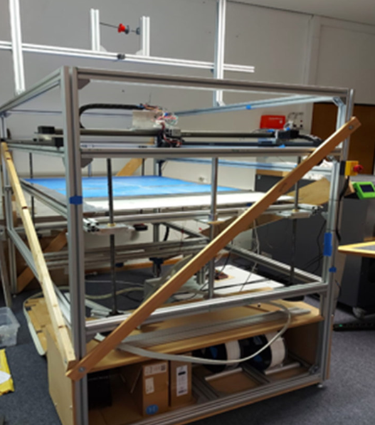

# ⚙️ Parallel Extruder Head for Continuous Fiber 3D Printing

This repository contains the **firmware, design files, and process documentation** for a custom-built extruder head designed for the 3D printing of continuous fiber-reinforced objects. Inspired by the **Markforged concept**, this project features a **parallel dual-extrusion system** capable of handling both standard filament (e.g., PLA) and **coated carbon fibers**, enabling the production of high-strength composite prints.

---

## ✨ Project Concept & System Overview

The image below illustrates the core concept: an integrated dual-extrusion head—one for standard polymer filament and another for the controlled feeding and cutting of coated carbon fibers.

  

---

## 🎯 Project Goals & Key Features

The primary objective of this project is to significantly improve the **tensile strength and structural integrity** of 3D-printed parts by embedding continuous or segmented carbon fibers into the print path.

### ✅ Key Features:

- **Fiber Reinforcement**: Optimized for co-extruding coated carbon fibers alongside standard filament (e.g., PLA).
- **Precision Mechanics**:
    - **Dedicated Stepper Motor** for accurate, separate fiber feeding.
    - **Servo Motor** with a sharp blade to precisely cut fiber segments after each reinforced section.
- **Lightweight Design**: Carefully engineered to reduce head weight for faster, more accurate prints.

---

## 🛠️ Design Overview & Realization

The custom print head was designed and realized with a focus on compactness and precision. It is fully integrated with slicing software (e.g., Cura) to allow for **strategic fiber placement** in designated toolpaths.

  
  
   <em>3D Render (Left) and Realized Physical Extruder Head (Right)</em>

 

  
   <em>Slicer View Showing Embedded Carbon Fiber Paths (for tensile test specimens)</em>

---

## 💻 Firmware & Electronics Integration (Marlin & RAMPS)

The extruder head's functionality is achieved by **modifying Marlin firmware** to handle the additional fiber-feeding stepper and servo-controlled cutter. All components were connected to a **RAMPS 1.4 control board**.

### ⚙️ The Base Printer

The custom extruder head was designed for integration into an existing Fused Layer Modeling (FLM) machine.

  
   <em>The large-format FLM printer providing the build volume and motion control for the project.</em>

### 🔌 RAMPS Connection Overview:

The following pins were utilized to integrate the custom extruder head while maintaining the base FLM printer functionality:

  
  
   <em>RAMPS Pin Diagram (Left) and Actual Wiring (Right)</em>

| Pin/Port Function | Purpose in Project |
|:------------------|:-------------------|
| **1. Heating Element** | Heating for the standard filament extruder (E0). |
| **2. Fiber Stepper** | Dedicated stepper motor for **fiber feed control**. |
| **3. End Stops** | Standard X, Y, Z limit switches for printer homing. |
| **4. Thermistor** | Temperature sensing for the hotend. |
| **5. Steppers (X/Y/Z)**| Standard motion control for the FLM printer. |
| **6. Auxiliary (AUX)** | Used for controlling the **fiber-cutting Servo Motor**. |
| **7. Fan 1** | Standard part cooling fan. |
| **8. Fan 2** | Used as an auxiliary fan or extruder cooling. |

### 📄 Firmware Modifications:

- Custom **Pin Assignments** in `Configuration_adv.h` for the new stepper (E1) and servo (AUX pin).
- G-code logic to precisely trigger the servo cutting action at the end of a fiber segment.
- Pulse generation and timing control for the stepper fiber extrusion mechanism.
- Control integrated via `M` or `G` commands for precise control within the G-code stream.

---

## 💾 Repository Contents

| File | Description |
|:------|:-------------|
| `concept.png` | Diagram showing the basic parallel extruder layout. |
| `Druckkopf.png` / `druckkopf.jpeg` | Render and photo of the final extruder head CAD design/realization. |
| `curapic.png` / `CuraCode.png` | Screenshots from Cura showing fiber paths and the corresponding **G-code logic** used to control the servo cutter. |
| `Rampsconnections.png` / `verschaltungBA.png` | Diagram and photo detailing the **electrical connections** to the RAMPS board. |
| `big3dprinter.png` | Photo of the large-format FLM printer used as the base machine. |
| `testresult.png` | Image showcasing a **successfully printed object with embedded fibers**. |
| `Servo.Code.ino` | Standalone Arduino sketch for initial testing and calibration of the **servo cutting control**. |
| `Stepper_Code.ino` | Standalone Arduino sketch for initial testing and calibration of the **stepper fiber feed**. |
| `Configuration.h` | Main Marlin configuration file (printer parameters, thermistors, steps, limits). |
| `Configuration_adv.h` | Advanced Marlin settings, including custom stepper and servo pin definitions. |
| `Marlin.confi.ino/` | Folder containing modified Marlin firmware for the parallel extrusion setup. |
| `Version.h` | Version info and build metadata for Marlin. |

---

## 📊 Results & Process Limitations

  
   <em>Example of a printed part demonstrating fiber embedding.</em>

While the developed system successfully integrated the mechanical and electronic components for dual-extrusion, **the initial printing process optimization revealed significant challenges.**

* **Process Limitation:** During test prints, the **continuous carbon fiber tended to shear off** prematurely before the current print layer was completed, compromising the intended reinforcement.
* **Next Steps:** This issue indicates that the current combination of print parameters (temperature, speed, fiber feed rate, and bonding agent activation) is not yet fully optimized. **Further iterative parameter studies are urgently required** to achieve consistent, defect-free fiber embedding and validate the full strength potential of the composite parts.

---

## 📌 Notes

-   Fiber placement currently requires manual G-code injection or custom post-processing scripts.
-   The servo cutter blade can be replaced or upgraded depending on the specific fiber material used.
-   **The presented system serves as a functional prototype; optimization of print parameters (especially to prevent fiber shearing) is the focus of subsequent process iterations.**

---

## 🤝 Contributions

Ideas, suggestions, and PRs are welcome—whether it’s for improving slicing strategies, mechanical enhancements, or smarter firmware logic.

---

## Patents & Related Work

This project is inspired by commercial concepts, which can be explored further in the following patents:

